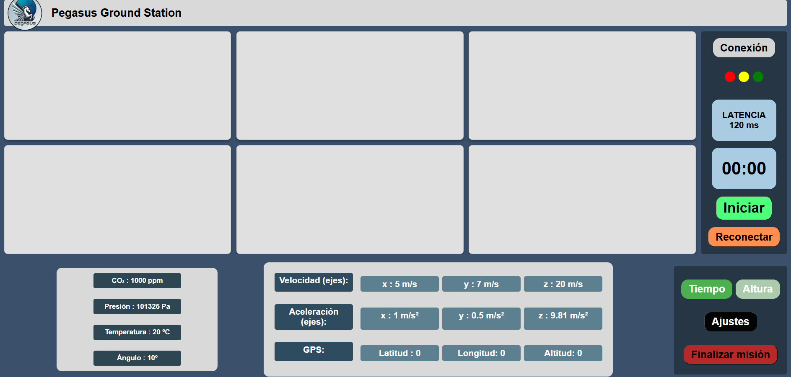

# Pegasus Ground Station

Para ejecutar este proyecto, clonar el repositorio:

`git clone https://github.com/siok20/Pegasus.git`

El proyecto tiene la siguiente arquitectura:

```
.
├── README.md
├── connection
├── interface
├── server
└── venv
```

## Software Requerido
- **``python``**
- **``NodeJS``**
- **``Docker``** (opcional)

## Carpeta `server`
Acceder a la carpeta e instalar las dependencias

```bash
cd server
npm install
```

Levantar el servidor en el puerto 3000

```bash
npm run start
```

Salida esperada:

```bash
$ npm run start

> pegasus_server@1.0.0 start
> node server.js

Servidor corriendo en http://localhost:3000
```

En este punto tenemos el servidor escuchando peticiones

## Acceder a la interfaz

Siguiendo del paso anterior regresar  a la carpeta raíz del proyecto y abrir `interface/index.html`

```bash
cd ..
start interface/index.html 
```



Seleccionar el botón `iniciar` para conectarse al servidor

Salida esperada en el servidor:

```bash
$ npm run start

> pegasus_server@1.0.0 start
> node server.js

Servidor corriendo en http://localhost:3000
Usuario conectado: ktZrXBjZJy-shfDOAAAB
Mensaje recibido: { texto: '¡Hola servidor!' }
```

Apretando el botón `Finalizar mision` en la interfaz. El servidor escucha el evento y resulta:

```bash
$ npm run start

> pegasus_server@1.0.0 start
> node server.js

Servidor corriendo en http://localhost:3000
Usuario conectado: k48wRt69njsycDD9AAAB
Mensaje recibido: { texto: '¡Hola servidor!' }
Usuario desconectado: k48wRt69njsycDD9AAAB
```

## Envío de datos

Preparar el entorno virtual de python e instalar las dependencias

```bash
python -m venv venv
.\venv\Scripts\activate.bat
pip install -r connection/requirements.txt
```

Se necesita una conexión serial enviando datos siguiendo este modelo:

```txt
BMP  temperature:26.80      presion:100238     alture:90.90       
MPU ax:0.77 ay:-0.27        az:9.63 gx:-0.01        gy:0.05 gz:0.03
GPS latitude:120 longitude:180
```

con esta conexión podemos ejecutar el script

```bash
python connection/serial_connection.py
```